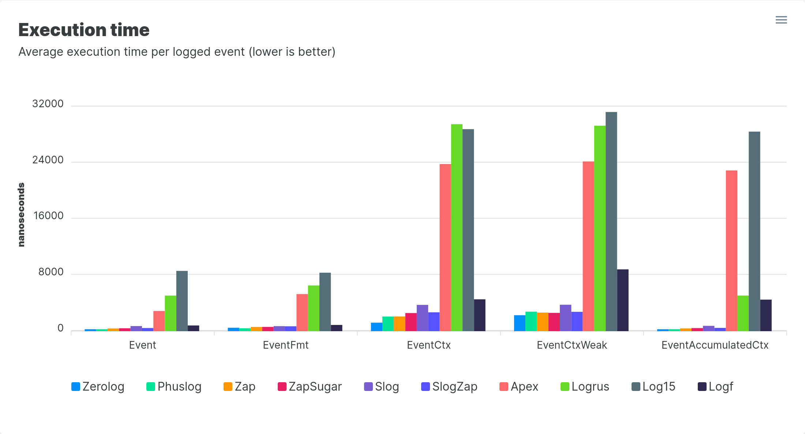

# Go Logging Benchmarks

This repo compares the performance of popular
[Go Logging Libraries](https://betterstack.com/community/guides/logging/best-golang-logging-libraries/)
including the new Slog package.

[See the results](https://betterstack-community.github.io/go-logging-benchmarks/).

The following libraries are being tested:

- [Zerolog](https://github.com/rs/zerolog).
- [Zap](https://github.com/uber-go/zap).
- [Apex/log](https://github.com/uber-go/zap).
- [Logrus](https://github.com/sirupsen/logrus).
- [Slog](https://pkg.go.dev/log/slog).
- [SlogZap](https://github.com/uber-go/zap/tree/master/exp/zapslog) (Slog with
  Zap backend).
- [Phuslog](https://github.com/phuslu/log).
- [Log15](https://github.com/inconshreveable/log15).
- [Logf](https://github.com/zerodha/logf).

.

## 🟢 Prerequisites

You only need [a recent version of Go](https://go.dev/doc/install) to execute
the benchmarks.

## 📦 Getting started

- Clone the repository to your computer:

```bash
git clone https://github.com/betterstack-community/go-logging-benchmarks && cd go-logging-benchmarks
```

- Download the dependencies:

```bash
go mod tidy
```

- Execute the benchmarks:

```bash
go test -bench=. -benchmem
```

## ⚖ License

The code used in this project and in the linked tutorial are licensed under the
[Apache License, Version 2.0](LICENSE).

## 🤝 Contribute

If you found an issue with the benchmarks, or you want to propose a new library
for benchmarking, please open an issue or pull request accordingly.
